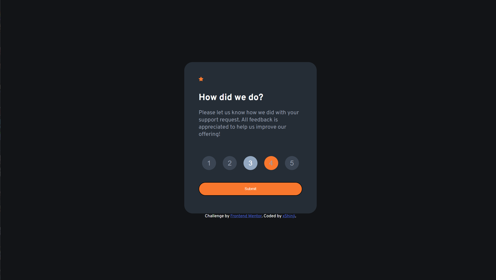
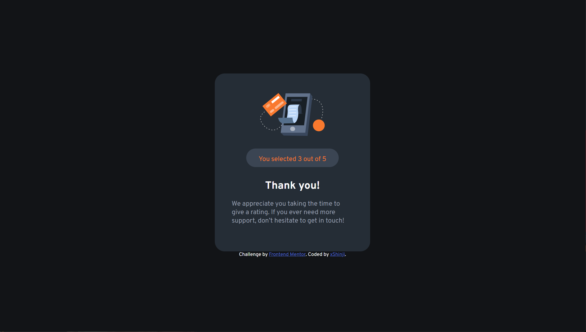

# Frontend Mentor - QR code component solution

This is a solution to the [QR code component challenge on Frontend Mentor](https://www.frontendmentor.io/challenges/qr-code-component-iux_sIO_H). Frontend Mentor challenges help you improve your coding skills by building realistic projects. 

## Table of contents

- [Overview](#overview)
  - [Screenshot](#screenshot)
  - [Links](#links)
- [My process](#my-process)
  - [Built with](#built-with)
  - [What I learned](#what-i-learned)
  - [Continued development](#continued-development)
- [Author](#author)
- [Acknowledgments](#acknowledgments)


## Overview

### Screenshot
- Rating Form Card


- Thank You card

### Links

- Solution URL: https://github.com/mrxshinji/FE_Mentor-Interactive-rating-component
- Live Site URL: https://mrxshinji.github.io/FE_Mentor-Interactive-rating-component/

## My process

### Built with

- Semantic HTML5 markup
- Flexbox
- CSS Grid
- Mobile-first workflow

### What I learned

Practice jquery which i just learned right before doing this task. Im shocked how much shorter the code is.

Was having hard time and googline on how to unselect other button when another button is pressed until I realized i can do it easily like below;

```js
$(".btn").click(function() {
    $(".btn").removeClass("active") // target all button and remove active class if any
    $(this).addClass("active") // this button only have active class when clicked
})
```

### Continued development

-Still require more practice on centering item.

### Useful resources

- [https://stackoverflow.com/] - Provide alot of insight on centering item.
- [https://www.w3schools.com/] - Provide alot help on syntax and how to use each method
- [https://api.jquery.com/] - Lots of jQuery function usage and syntax to copy from 

## Author

- Website - [https://github.com/mrxshinji]
- Frontend Mentor - [@mrxshinji](https://www.frontendmentor.io/profile/mrxshinji)

## Acknowledgments

[Mark's solution](https://www.frontendmentor.io/solutions/interactive-rating-component-using-html-form-and-javascript-Qm-7QFLxCF) - Glance through the codes for some insight and to check am I on the right path. Thanks!

